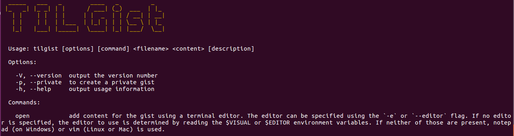

# TILGist

TILGist is a command line tool to aid collecting your daily snippets of learning on Github as gists

## Getting Started

### Prerequisites
1. Nodejs version 9.6.1
2. npm version 4 or higher

### Setup Instructions
1. Clone the repo
2. Run `npm install`
3. Run `npm link` or `sudo npm link`
4. Run `tilgist` to get instructions on how to use the CLI tool

## Usage Examples

1. To create a private gist
    - `tilgist -p fileName.txt "Content for the file" "Description for the file"`

2. To create a publish gist
    - `tilgist fileName.txt "Content for the file" "Description for the file"`

3. To create a gist using the terminal editor
    - `tilgist open`
    - Follow the prompts for 'filename' and 'description`

## Storing Github credentials
When you run the CLI tool the first time, tilgist generates an OAuth token to connect to your github account. On further invocations of the CLI tool, the stored token is used. 

The OAuth token is stored locally on your machine using the npm library [configstore](https://www.npmjs.com/package/configstore)

The access for the OAuth token is limited creating gists

